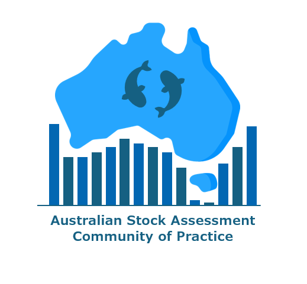

{fig-alt="An image from underwater, looking up, of an abundance of finfish swimming in a circle." fig-align="center"}

Our Community of Practice was officially launched in April 2026, with the mission to build a collaborative community of stock assessment practitioners to better support sustainable fisheries management. You can read more about the Community of Practice in our [1-page summary](https://docs.google.com/document/d/11b7GrhenKp7e2m0mI99rqXP-bOtv1q15/edit?usp=sharing&ouid=116198756358944992136&rtpof=true&sd=true){target="_blank"}.

<!-- Something general about what the workshop is, first of many, etc -->

<!-- Something about FRDC funding the project. -->

-   **Time**: 10-14 August, 9am–5pm AEST
-   **Location**: Ecosciences Precinct (Conference Room, Ground Floor), 41 Boggo Rd, Dutton Park QLD—or online
-   **Cost**: Free. Travel and meals are at the expense of attendees.

```{=html}
<a href="https://forms.gle/8p8aXELgcbedA9up8" target="_blank" rel="noopener noreferrer" style="text-decoration:none;">
  <div style="
    background-color:#1f4e79;
    color:white;
    padding:18px;
    border-radius:10px;
    font-weight:500;
    text-align:center;
    font-weight:bold;
  ">
    Register your interest in the event here!
  </div>
</a>
```
## Who is this conference for?

This workshop will comprise of two parts:

-   Days 1 to 2 of this workshop is generally aimed at **stock assessment scientists**. The schedule contains conference style activities for introduction and networking.
-   Days 3 to 5 is aimed at both **stock assessment scientists** and **fishery managers**. Over these three days, Prof Andre Punt will lead his course "MSE with Managers".

If you are unsure which part is best for you, [get in touch](mailto:stockassessmentcop@gmail.com).

There is limited capacity in the room so we will prioritise stock assessment science practitioners for in person attendance.

All 5 days of the workshop will be delivered in a hybrid format (both online and in person).

------------------------------------------------------------------------

{fig-alt="The logo consisting of a blue illustration of Australia, with two fish overlaid, sitting above a bar chart, with text saying: Australian Stock Assessment Community of Practice" fig-align="center"}
